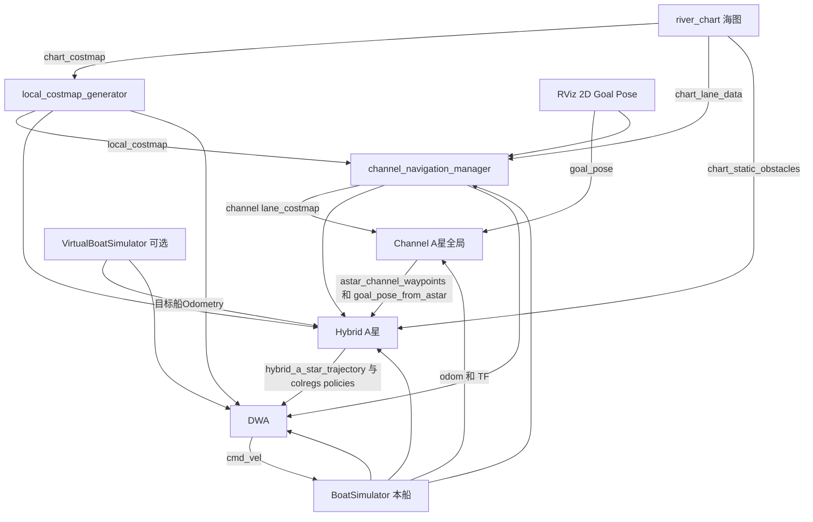

# 无人船工作空间：功能与参数文档索引

本轮仅增加代码/参数注释和说明，不改变算法、参数值、话题或控制行为。每包 FUNCTIONAL_GUIDE.md 包含节点启动、包内/函数流程图、包间接口、逐函数职责及实现边界；PARAMETERS.md逐项说明当前配置和调节趋势。代码中搜索 `[功能与联系]`，YAML搜索 `[作用与调节]` 即可定位新增注释。

## 每包文档

| 包目录 | 主要作用 | 功能和函数说明 | 参数说明 |
|---|---|---|---|
| channel_navigation_manager | 静态航道几何的运行时方向分类与中心代价 | [功能说明](src/channel_navigation_manager/FUNCTIONAL_GUIDE.md) | [参数说明](src/channel_navigation_manager/PARAMETERS.md) |
| hybrid_a_star_planner | 固定频率局部路线、动态避碰、会遇策略及安全平滑 | [功能说明](src/hybrid_a_star_planner/FUNCTIONAL_GUIDE.md) | [参数说明](src/hybrid_a_star_planner/PARAMETERS.md) |
| dwa_and_ship_sim | ROS名dwa_deep，短时跟踪控制及本船运动仿真 | [功能说明](src/dwa_and_ship_sim/FUNCTIONAL_GUIDE.md) | [参数说明](src/dwa_and_ship_sim/PARAMETERS.md) |
| local_costmap_generator | 物理静态地图双距离场膨胀 | [功能说明](src/local_costmap_generator/FUNCTIONAL_GUIDE.md) | [参数说明](src/local_costmap_generator/PARAMETERS.md) |
| virtual_boat_simulator | 测试目标船运动及显示 | [功能说明](src/virtual_boat_simulator/FUNCTIONAL_GUIDE.md) | [参数说明](src/virtual_boat_simulator/PARAMETERS.md) |
| channel_astar_global_planner | 一次任务级A*与航点切换，主航道角色变化补规划 | [功能说明](src/channel_astar_global_planner/FUNCTIONAL_GUIDE.md) | [参数说明](src/channel_astar_global_planner/PARAMETERS.md) |
| river_chart | 河图解析、矢量显示、静态核心/基础栅格/航道几何 | [功能说明](src/river_chart/FUNCTIONAL_GUIDE.md) | [参数说明](src/river_chart/PARAMETERS.md) |
| free_water_map | 备用开阔水域地图、一次初始目标及会遇测试 | [功能说明](src/free_water_map/FUNCTIONAL_GUIDE.md) | [参数说明](src/free_water_map/PARAMETERS.md) |

## 主要包间数据流



地图可一次发布且用持久化QoS被晚启动节点读取；消息到达顺序不固定。静态图与静态航道几何不随船转向“翻转”，manager重新解释几何并发布运行时语义。全局包事件触发、Hybrid固定频率、DWA高频控制，职责不能混淆。

绿色矢量边线不是规划路径；黄色全局连线主要连接稀疏任务航点；细绿色Hybrid路线是局部搜索结果；DWA只预测短时间实际可执行运动。三个层次不能要求拥有相同点密度或形状。

## 启动与日常操作

```bash
cd /home/l/work_ws
source /opt/ros/humble/setup.bash
colcon build --symlink-install --executor sequential
source /home/l/work_ws/install/setup.bash
ros2 launch channel_navigation_manager river_navigation.launch.py
```

默认不发布虚拟船。需要会遇测试时，关闭当前实例后以 `use_virtual_boat:=true` 重启，也可设置 target_x、target_y、target_yaw。只运行一套本船与TF，避免重复base_link。启动后在RViz使用2D Goal Pose，map下目标由全局节点转换；当前一键map→odom是单位TF。manager的最终目标回调尚无独立TF转换，若未来使用非单位TF应另行修复后验证。

选左航道或航道外安全目标时，全局主体优先主航道，末端可到目标；危险/未知区域仍不允许。新目标撤销旧任务；主航道角色真的变化会触发一次补规划，不会因为每次里程计移动就搜索。

核对有效参数：`ros2 param dump /channel_astar_node`、`ros2 param dump /hybrid_a_star_node`；其他节点先使用 `ros2 node list` 确认名字。参数多在构造时读取，改YAML后重启，不能假设在线设置一定生效。

## 重点实现边界

- 岸线膨胀与真实障碍必须区分。航道内清岸线代价不应清独立障碍；现有预留PoseArray入口没有接成完整独立障碍链。
- local_costmap_generator中的unknown_is_obstacle目前未被活动算法使用；历史831备份也未参与编译。
- Hybrid部分兼容角度参数并不控制主策略全部分类，实际用处在参数文档标注。
- 路径显示保留和允许船继续跟踪是两件事：DWA有独立时效检查。
- Hybrid每周期仍重新搜索；跨周期近场连续性采用距离衰减的软约束。近处强、远处弱，动态碰撞和COLREG硬约束可立即覆盖；会遇安全通过后近场旧路径约束立即释放。
- 当前小型无人船测试使用2m普通硬净空/最终停车线、3m追越硬净空、8m软规划域；AIS式80m/40s监视保持不变。4m/s下2m不是足够的物理制动起点。
- 平滑复核不等于水动力学/曲率上限或实船法规认证；仿真没有完整物理碰撞阻挡。
- 文档中的当前值来自源码YAML；launch追加值优先，river_chart直接由launch设参数，没有已加载YAML。

## 验证方法

```bash
source /opt/ros/humble/setup.bash
source /home/l/work_ws/install/setup.bash
colcon test --packages-select channel_astar_global_planner channel_navigation_manager hybrid_a_star_planner river_chart --executor sequential
colcon test-result --verbose
```

这轮注释工作应通过“去除注释后源码一致、Python语法、YAML解析、全包编译和已有自动测试”验证。已有闭环报告保留其具体场景/持续时间，不把短时联动测试解释为任意会遇全部通过。当前验证结果见 DOCUMENTATION_VERIFICATION.md。
