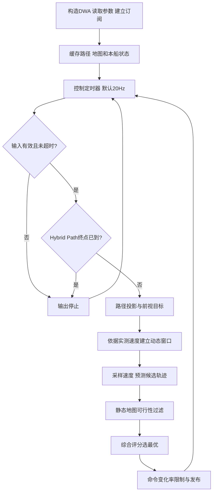
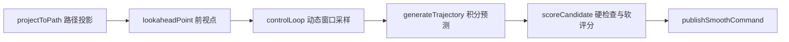
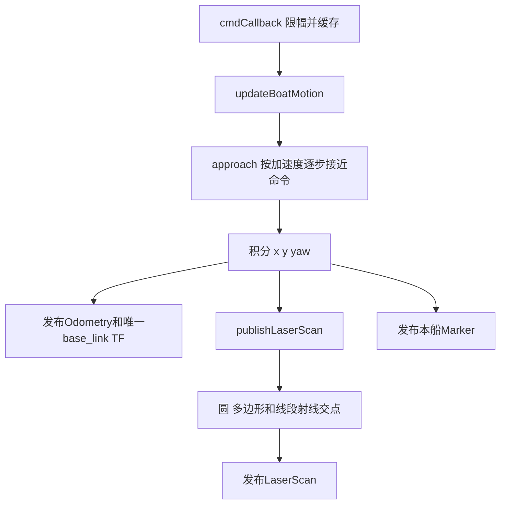

# DWA 与本船仿真说明

注意：源码文件夹叫 dwa_and_ship_sim，ROS 包名是 **dwa_deep**。运行命令要使用 ROS 包名。默认 `tracking_only=true`，动态避碰由Hybrid A*统一处理。

## 1. 节点与接口

DwaPlanner 在 dwa_planner.cpp 中负责跟踪 Hybrid 路径并选择短时可行速度；BoatSimulator 在 boat_simulator.cpp 中根据速度指令积分本船状态。

| 方向 | 话题 | 功能联系 |
|---|---|---|
| DWA输入 | /hybrid_a_star_trajectory | Hybrid 连续提供避障航线 |
| DWA输入 | /local_costmap、/channel/lane_costmap | 静态安全与航道代价 |
| DWA输入 | /channel/obstacle_costmap（可选） | 独立障碍层，当前需外部生产者 |
| DWA输入 | /odom、Hybrid Path、local_costmap | 实际速度窗口和路径跟踪；动态船/COLREG由Hybrid统一处理 |
| DWA输出 | /cmd_vel / Twist | 仿真线速度、角速度命令 |
| DWA输出 | /optimal_trajectory | 选中的短时预测轨迹 |
| DWA输出 | /candidate_trajectories | 候选轨迹调试显示 |
| DWA输出 | /dwa_lookahead_target | 当前前视跟踪目标 |
| DWA输出 | /optimal_path | 收到的路径显示/转发，不是另一套全局规划 |
| 仿真输出 | /odom、odom→base_link TF | 提供本船位姿和实际速度 |
| 仿真输出 | /scan | 仅内置圆/多边形障碍的模拟激光，不是河图或虚拟船感知 |
| 仿真输出 | /sim_boat_marker、/sim_obstacles | 本船和内置障碍可视化 |

Twist.linear.x 是m/s，angular.z 是rad/s。里程计线速度在船体坐标中，规划器会转换到地图坐标预测。

## 2. 启动和控制流程

实测里程计速度用于下一周期窗口，不应把它误认为完全由上次发送命令决定。默认21×31速度候选，预测3秒、时间步长0.05秒；更多候选/更长预测耗时增加。

具体函数名以末尾源码函数索引为准。评分同时考虑路径距离、进度、方向、障碍、速度和控制变化；硬安全失败的候选不能靠高速度奖励获胜。大速度权重并不意味不减速；目标剩余距离、转角和急停仍优先限制速度。

## 3. 失效保护和边界

默认 `tracking_only=true`。DWA只跟踪Hybrid A*发布的Path，动态船距离、DCPA/TCPA、COLREG方向和会遇恢复均不在DWA中二次判定。事件规划模式会持续重发同一条安全路径的时间戳，因此“只搜索一次”不会造成DWA路径过期。DWA只在没有可跟踪Path、输入失效、静态候选全部不可行或到达Path终点时停止；动态风险下由Hybrid发布空Path，DWA再执行停车。

航道语义允许忽略岸边膨胀，因此航道内真实障碍必须进入独立障碍层，不能仅混在岸线层里。DWA没有独立订阅河图原始陆地核心的完整防护链；不能把“在航道内清岸线代价”解释为对所有地图错误都安全。本轮只记录边界，没有改功能。

普通全局航点8米以内切换，途经点另有严格阈值；DWA仍根据当前收到的局部路径终点减速。修改全局切换阈值不等于修改DWA终点容差。

## 4. 仿真启动与函数关系

BoatSimulator 构造时读取初始位置、航向、速度上限、障碍开关，创建状态更新与显示定时器。当前最高线速度4m/s，初始位置(-270,-270)。初始速度与实际有效配置以启动文件为准；没有控制输入时不应假定它必定静止。

内置线加速度0.8m/s²、角加速度2rad/s²、更新步长0.05秒在代码中，不是现有YAML可调项。急停命令立即归零，但仿真实际速度受加速度限制逐渐下降，并非瞬间停止。仿真没有完整水动力学、地图碰撞物理阻挡或完善命令失联看门狗；它不能代替实船执行器安全保护。

请只运行一个本船仿真节点，否则会出现两艘base_link显示、里程计和TF竞争。不要在运行河道一键启动时再启动开阔水域一键场景。

## 源码函数逐项索引

以下按文件列出已注释函数。`[功能与联系]`代码注释可直接定位职责；同名重载/不同类函数分列。函数内局部计算与分支说明保留原有注释。流程图展示主要调用链，表格覆盖辅助函数、入口和测试。

### src/dwa_planner.cpp

生产或启动辅助源码。

| 函数 | 主要职责、调用联系与作用 |
|---|---|
| `DwaPlanner` | 读取控制/动态窗口/航道参数，订阅Hybrid路径并建立控制timer与RViz输出；默认不订阅目标船/策略，不负责生成稀疏全局航点。 |
| `pathCallback` | 接收Hybrid连续路径；少于两点立即清除可跟踪路径并发布STOP，正常路径更新接收时间。 |
| `costmapCallback` | 缓存物理地图及其网格元数据；航道节点用于对齐语义图，规划/控制节点用于碰撞和数据就绪检查。 |
| `odomCallback` | 缓存里程计和接收时间供controlLoop使用；实测速率用于动态窗口及失联保护。 |
| `controlLoop` | 先做跟踪输入有效性检查，再投影Hybrid路径与前视、建立动态窗口、生成评分候选并输出Twist；默认不执行动态船停车。 |
| `generateTrajectory` | 按候选常速度/角速度预测sim_time内姿态；scoreCandidate逐点检查静态/动态安全。 |
| `scoreCandidate` | 先用COLREG、同步目标净空和地图淘汰危险候选，再累计路径/进度/朝向/避障/速度/连续性评分，选择分数最大的候选。 |
| `projectToPath` | 把船或候选终点投影到最近路径段，得到横向距离与弧长进度；控制前视和评分共用。 |
| `lookaheadPoint` | 按路径累计弧长插值前视目标；controlLoop结合速度自适应前视距离使用。 |
| `pathHeadingAt` | 按指定弧长查询路径切向，用于候选终点朝向评分。 |
| `costAt` | 按地图原点姿态/分辨率查询代价，越界/缺图返回保守或未提供值；支撑多源融合和候选淘汰。 |
| `publishSmoothCommand` | 按变化限幅输出最佳Twist；使用实测速度建立约束，紧急STOP不经过这一平滑流程。 |
| `publishStop` | 直接输出零线速度和零角速度并重置命令记录；物理仿真仍按惯性制动，不代表瞬时停止。 |
| `publishOptimalPath` | 发布跟踪输入Path作为控制诊断；不是另一层全局搜索。 |
| `publishOptimalTrajectory` | 将最优局部预测候选绘为Marker，供RViz观察短时控制意图。 |
| `publishCandidates` | 绘制候选轨迹并区分有效/无效或评分；显示开销随速度采样数量增加。 |
| `publishLookaheadTarget` | 显示当前前视点，辅助定位跟踪方向与转弯响应。 |
| `pathPoint` | 按索引读取Path坐标；用于路径投影、前视插值及终点判断。 |
| `distance` | 计算两点欧氏距离，用于目标容差和路径段长度。 |
| `clamp` | 将标量限制到上下界，供速度/评分/插值计算共用。 |
| `normalizeAngle` | 归一化角度，消除跨±pi的跳变；方向比较、运动积分和COLREG约束共同使用。 |
| `interpolate` | 在上下界内按采样索引生成速度或角速度候选。 |
| `main` | 初始化ROS上下文、创建本文件节点并进入回调调度；退出时释放节点与通信资源，是launch启动可执行程序后的入口。 |

### src/boat_simulator.cpp

生产或启动辅助源码。

| 函数 | 主要职责、调用联系与作用 |
|---|---|
| `BoatSimulator` | 建立本船初始状态、简化惯性模型与控制订阅，启动20Hz运动和数据发布；只能运行一个base_link发布者。 |
| `cmdCallback` | 接收本船Twist并按速度上限缓存命令；updateBoatMotion经加速度约束逐步接近目标速率。 |
| `update` | 本船仿真定时入口，依次调用updateBoatMotion、publishOdomAndTf、publishLaserScan与publishBoatMarker，统一推进状态并发布观测。 |
| `updateBoatMotion` | 按固定加速度限制逼近目标v/w，再积分位置与航向；只是简化惯性，不是水动力学模型。 |
| `publishOdomAndTf` | 发布本船/odom及odom→base_link，反馈给航道分类、两级规划器并供RViz定位。 |
| `publishLaserScan` | 对内置几何障碍进行射线交点模拟/scan；不会自动扫描river_chart海图或形成障碍costmap。 |
| `rayCircleIntersection` | 求射线与内置圆障碍最近正交点距离，供模拟LaserScan使用。 |
| `rayPolygonIntersection` | 遍历多边形边求射线最近交点，供模拟LaserScan使用。 |
| `raySegmentIntersection` | 用二维叉积求射线/线段交点及有效范围，供多边形扫描使用。 |
| `publishObstacleMarkers` | 显示内置静态障碍几何；河道模式关闭内置障碍，Marker不会自动形成代价地图。 |
| `publishBoatMarker` | 在本船姿态处显示模型；与TF显示重复开启时可能看似有两艘船。 |
| `cross` | 计算二维叉积，用于射线与边界交点求解。 |
| `approach` | 以最大步长将当前速率逼近指令值，供简化惯性更新。 |
| `normalizeAngle` | 归一化角度，消除跨±pi的跳变；方向比较、运动积分和COLREG约束共同使用。 |
| `main` | 初始化ROS上下文、创建本文件节点并进入回调调度；退出时释放节点与通信资源，是launch启动可执行程序后的入口。 |

### launch/dwa_sim.launch.py

生产或启动辅助源码。

| 函数 | 主要职责、调用联系与作用 |
|---|---|
| `generate_launch_description` | 组装节点、参数与条件启动动作；launch只负责接线，不直接执行规划或控制。 |
