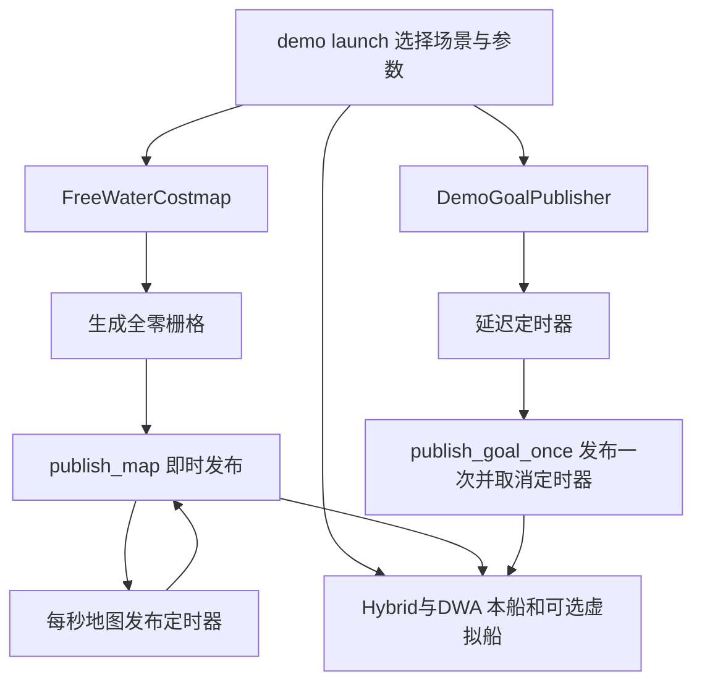

# 开阔水域测试包说明

本包是备用无岸线测试地图及演示启动，不是当前实际河道数据来源。主节点使用Python，用户只要求channel_navigation_manager主要节点改C++，不要把此包Python误认为回退。

## 1. 节点、话题和启动过程

FreeWaterCostmap 读取尺寸、分辨率、原点和frame，创建全零OccupancyGrid，构造时立即发布，随后每秒重新发布 /local_costmap。这是测试地图发布频率，不是全局A*持续搜索。默认290×180米、分辨率1米、原点(-120,-90)、odom坐标系；实际以加载YAML为准。

DemoGoalPublisher 在默认0.8秒延迟后发布一次 /goal_pose，取消定时器，避免反复覆盖RViz手工目标。publish_initial_goal可关闭初始自动目标。目标点默认(55,0)，yaw0。

| 输出/消费关系 | 用途 |
|---|---|
| /local_costmap → Hybrid和DWA | 自由水域边界以内全零，但图外不是无限可航行区 |
| /goal_pose → Hybrid | 演示初始目标或RViz手工目标 |
| 演示launch → 虚拟船/本船/Hybrid/DWA/RViz | 快速测试会遇，通常不启用河道语义与全局航点链 |
| tests中的验证程序 → 诊断报告 | 场景检查，不是生产控制节点 |

## 2. 包内功能和函数流程

函数关系很直接：构造负责参数、通信和定时器；publish_map打时间戳发布缓存地图；publish_goal_once组装PoseStamped再取消重复触发；main初始化ROS、spin、退出清理。launch函数组装节点，不做轨迹搜索。

## 3. 使用与测试边界

可以用本包demo launch做开阔水域会遇测试，文件名与可用参数见launch源码函数索引。不要与河道一键启动并行，否则 /local_costmap、/odom、base_link TF及控制指令可能竞争。

历史闭环测试及安全诊断脚本保留，文档中不把历史某次通过解释为所有未来场景通过。测试船体、冗余距离、TCPA等应与Hybrid/DWA/虚拟船配置一致；只有全零地图不能验证真实岸线安全。

## 源码函数逐项索引

以下按文件列出已注释函数。`[功能与联系]`代码注释可直接定位职责；同名重载/不同类函数分列。函数内局部计算与分支说明保留原有注释。流程图展示主要调用链，表格覆盖辅助函数、入口和测试。

### src/demo_goal_publisher.py

生产或启动辅助源码。

| 函数 | 主要职责、调用联系与作用 |
|---|---|
| `__init__` | 读取本节点参数并创建ROS输入输出/调度；后续回调与主循环关系见包内功能说明。 |
| `publish_goal_once_once` | 启动后取消自己的timer，可选发布一次演示目标；避免周期性覆盖用户RViz目标。 |
| `main` | 初始化ROS上下文、创建本文件节点并进入回调调度；退出时释放节点与通信资源，是launch启动可执行程序后的入口。 |

### src/free_water_costmap.py

生产或启动辅助源码。

| 函数 | 主要职责、调用联系与作用 |
|---|---|
| `__init__` | 读取本节点参数并创建ROS输入输出/调度；后续回调与主循环关系见包内功能说明。 |
| `publish_map` | 按参数构建全0有界开阔水域图并周期发布；仅用于演示，边界之外仍不可规划。 |
| `main` | 初始化ROS上下文、创建本文件节点并进入回调调度；退出时释放节点与通信资源，是launch启动可执行程序后的入口。 |

### launch/colregs_demo.launch.py

生产或启动辅助源码。

| 函数 | 主要职责、调用联系与作用 |
|---|---|
| `generate_launch_description` | 组装节点、参数与条件启动动作；launch只负责接线，不直接执行规划或控制。 |
| `launch_scenario` | 给选定演示会遇配置初始船位/目标等启动条件；演示入口绕过全局航点包，Hybrid直接接收/goal_pose。 |

### test/current_safety_checks.py

测试/诊断程序，不属于生产控制循环。

| 函数 | 主要职责、调用联系与作用 |
|---|---|
| `run` | 执行此场景的输入构造和断言核验；用于回归验证，不参与正常航行控制。具体通过条件以函数内断言为准。 |

### test/v4_closed_loop.py

测试/诊断程序，不属于生产控制循环。

| 函数 | 主要职责、调用联系与作用 |
|---|---|
| `yaw` | 执行此场景的输入构造和断言核验；用于回归验证，不参与正常航行控制。具体通过条件以函数内断言为准。 |
| `run` | 执行此场景的输入构造和断言核验；用于回归验证，不参与正常航行控制。具体通过条件以函数内断言为准。 |
