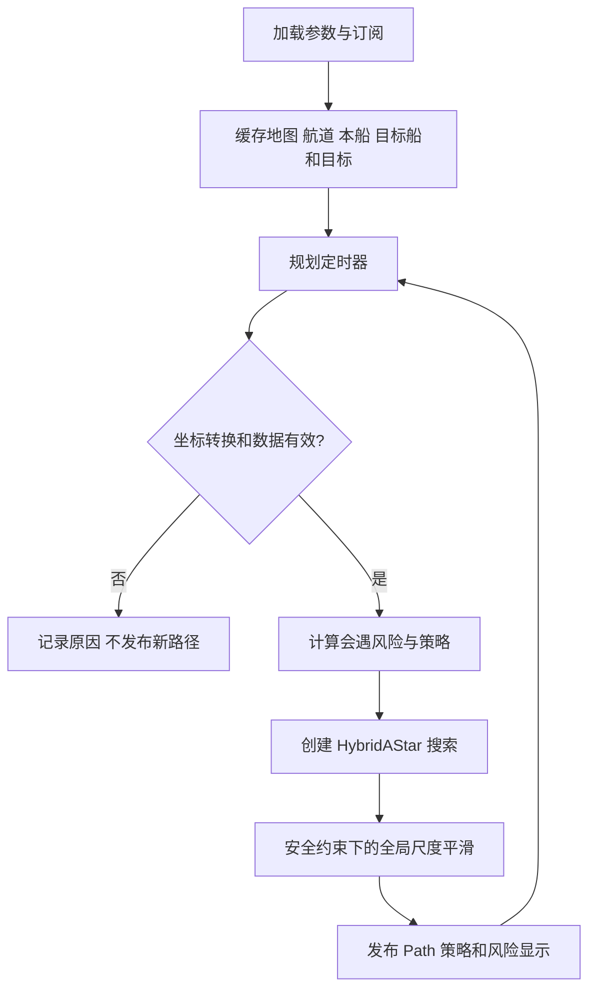
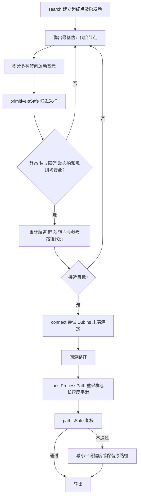

# Hybrid A*：局部航线、安全检查与平滑说明

参数逐项说明见 PARAMETERS.md。主算法类与ROS数据接入都在 src/hybrid_a_star_node.cpp；include 中的 COLREGs 风险与策略头文件被 Hybrid 和 DWA 共同使用。本包输出路径，不直接控制船。

## 1. 与其他包的关系

| 输入/输出 | 话题 | 职责 |
|---|---|---|
| 输入 | /local_costmap | local_costmap_generator 提供静态岸线及膨胀栅格 |
| 输入 | /chart_static_obstacles | river_chart 提供原始陆地核心，不能因航道优先而清零 |
| 输入 | /channel/lane_costmap | channel_navigation_manager 提供主航道、对向航道、航道外语义 |
| 输入 | /channel/obstacle_costmap（可选） | 独立障碍层；当前链路没有完整生产者，不能把它当成已经接入的传感器 |
| 输入 | /odom、TF | 本船位置、速度及坐标转换 |
| 输入 | 目标船 Odometry 配置话题 | virtual_boat_simulator 提供位置、航速，预测未来碰撞 |
| 输入 | /goal_pose_from_astar、/astar_channel_waypoints | 全局包提供当前航点，以及任务清空/任务版本保护 |
| 输出 | /hybrid_a_star_trajectory / Path | DWA 跟踪；RViz 显示细绿色航线 |
| 输出 | /colregs/policies | DWA 使用同一会遇决策约束，防止局部控制推翻全局避让 |
| 输出 | /colregs/encounter | 调试会遇状态摘要 |
| 输出 | /colregs/risk_markers、/colregs/avoidance_envelope | 风险圈、预测和避让范围可视化 |

独立启动的目标话题可能为 /goal_pose；河道一键启动会覆盖为全局包输出。因此最终以 launch 与 YAML 合并后的参数为准。

## 2. 节点启动和数据流

构造函数读取参数、建立 TF 缓存、创建订阅/发布和固定频率定时器。消息先后到达不固定；节点每次检查起点、目标、地图、TF、里程计及交通数据是否可用。缺少条件时不盲目规划。静态水域也持续按频率搜索，不采用“地图未变就停止搜索”的方案。

数据失效或搜索失败时，为避免 RViz 闪烁，旧路径可能仍显示；这不表示允许一直沿旧路径航行。DWA 独立检查路径时间戳，默认过期停止。全局新任务清空路径时，下游也清除旧任务跟踪。

## 3. 搜索函数之间的关系

运动基元决定船能走的圆弧；wheelbase 与 max_steer_angle 决定实际搜索转弯半径。min_turning_radius 主要参与启发估计，不能只改它就认为真实轨迹半径被严格限制。动态船存在时，搜索状态加入到达时间桶，防止同位置但不同抵达时刻被错误合并。

物理安全层与航道偏好分开：原始陆地、独立障碍硬约束始终保留；已确认航道内仅允许忽略岸边膨胀，不应忽略独立障碍。航道中心、航道外和对向航道属于代价偏好，不是让安全检查失效的许可。

## 4. 整体平滑与避障如何兼容

平滑不只是把小段折线变成圆弧。相邻点平滑项减少局部锯齿，long_scale 平滑项减少较长距离的左右波浪；参考上一条路线是软代价，降低连续搜索结果的横向漂移。每次仍搜索，必要时可偏离旧路线避让。

每轮平滑后重新采样检查岸线、独立障碍、时间同步动态船和避让方向；失败会缩小幅度或退回当前有效路径。此检查不等于完整船舶动力学或平滑后曲率上限认证，实船还需要验证操纵性能。

建议一次只改一个量：整体波浪多先调长尺度项和作用跨度；局部锯齿调普通平滑项；贴岸或偏离安全通道时降低最大横向偏移并检查航道中心代价。更大平滑权重并不保证任何地形都更好，过大可能抹平必要绕行或增加回退。

## 5. 会遇状态与风险圈

DCPA 是匀速匀向假设下最近会遇距离，TCPA 是到达最近点的时间。TCPA<0 通常表示最近会遇已过去；DCPA 不是当前两船距离。风险综合 DCPA 与“当前距离或 TCPA”，不应只看一个圈判断。

当前默认 MONITOR/ACTION/EMERGENCY 的 TCPA 为40/24/10秒，距离细圈为80/48/20米，即目标船2m/s乘对应时间；DCPA阈值10/9/8米。细距离圈是评估阈值，不是传感器最大探测半径。TCPA 本身是时间，不存在唯一的物理圆：显示中的预测位置和文字用于解释其含义。

默认动态硬间隔为本船半径1.5+目标船半径2+冗余4=7.5米；追越还可能采用9米间隔。DWA 当前实际距离小于8米独立停船，和预测间隔不是同一条件。避让显示9米也不等于所有搜索分支的固定绕行距离，具体受速度、规则、运动学及航道限制影响。

策略以最初参考航向/航速做反事实碰撞判断，避免右转后风险消失就立即左转、随后又右转的振荡。恢复判定又使用实际运动状态；通过并确认远离后进入恢复，恢复状态放松避让航向限制，允许重新跟踪。不是简单固定直航等待计时器。

部分策略角度仍在策略内部固定使用，YAML 中兼容角度参数并不全都控制主策略；详见 PARAMETERS.md。实现是工程近似，不构成 COLREGs 法规符合性或实船安全认证。

## 6. 操作与排查

先启动河道整条链路，再通过 RViz 2D Goal Pose 发布目标。看全局黄色点、局部绿色路线和 DWA 短预测，三者不是同一种轨迹。规划失败时检查诊断、目标有效性、TF、地图对齐和搜索上限，再调整参数，不要先关闭硬安全阈值。

测试包括算法、策略/平滑及任务联动；运行方法见工作空间 PACKAGE_DOCUMENTATION_INDEX.md。旧测试记录应按场景与持续时间理解，不表示任意动态会遇全部通过。

## 源码函数逐项索引

以下按文件列出已注释函数。`[功能与联系]`代码注释可直接定位职责；同名重载/不同类函数分列。函数内局部计算与分支说明保留原有注释。流程图展示主要调用链，表格覆盖辅助函数、入口和测试。

### src/hybrid_a_star_node.cpp

生产或启动辅助源码。

| 函数 | 主要职责、调用联系与作用 |
|---|---|
| `setParams` | 配置运动基元和搜索分辨率/迭代限制；由ROS节点构造时赋值，影响search状态扩展。 |
| `setDynamicParams` | 配置航速、半径、安全冗余及动态软代价；primitiveIsSafe和尾段检查按相同时间模型使用。 |
| `setCostmap` | 缓存物理栅格尺寸/原点/分辨率并初始化查询状态；搜索必须已有地图。 |
| `setDynamicObstacles` | 注入本周期目标船预测状态与策略；search、平滑检查及COLREG约束共同读取。 |
| `setChannelParams` | 配置分源静态安全与航道区域软权重；isLethal决定硬安全，navigationCostAt决定区域偏好。 |
| `setStabilityParams` | 设置旧路径参考和舵角连续性软权重；只偏好稳定，不直接复用旧搜索路径。 |
| `setReferencePath` | 提供上周期有效路径，建立近端参考距离；新目标时应清除，避免旧任务妨碍新任务。 |
| `setRecoveryParams` | 设置风险恢复软连续性和终点减速预测模型；动态安全恢复不依赖固定直航等待时间。 |
| `recoveryContinuityActive` | 返回恢复方向仍有动态风险的内部标记；用于测试验证软连续性门控。 |
| `dynamicObstacles` | 返回search更新后的策略/目标快照；节点将恢复标志同步发布给DWA，避免两级约束不一致。 |
| `estimateSegmentTime` | 由段长及巡航/终点制动模型估计耗时；运动基元、尾段和平滑复查使用相同时间基准。 |
| `setLaneCostmap` | 注入动态航道语义；区域偏好不应与物理硬障碍数据混合。 |
| `setStaticLandMap` | 注入原始陆地核心层；航道内清除岸边膨胀也不能覆盖真实陆地。 |
| `setChannelObstacleMap` | 注入独立障碍膨胀层；航道自由水域规则不能消除这一来源的障碍。 |
| `isLethal` | 优先检查陆地和独立障碍；已识别航道只忽略岸边膨胀，航道外按未知/岸边阈值拒绝。 |
| `isStartValid` | 核验船位在地图内且不是硬危险格；search启动前调用。 |
| `search` | 执行时空Hybrid A*：探测恢复方向、构建启发与参考场、扩展运动基元/近端Dubins连接并回溯；每局部周期重新运行。 |
| `postProcessPath` | 统一弧长采样并迭代短/长尺度平滑；每次候选由pathIsSafe复查，不安全缩步或退回原安全结果。 |
| `updatePathHeadings` | 由平滑点邻域切向更新中间姿态，保留起终姿态；为headingAllowed与输出轨迹提供一致航向。 |
| `pathIsSafe` | 沿每段加密取样，重新计算时间、静态危险和目标同步净空/COLREG约束；是平滑候选接受门槛。 |
| `connect` | 生成近终点Dubins尾段，限制过长绕行，并沿曲线复查静态/动态/规则安全；不是可绕过碰撞检查的直连。 |
| `worldToMap` | 将世界点换算到主物理栅格并检查边界；供硬碰撞和状态索引使用。 |
| `costAt` | 按地图原点姿态/分辨率查询代价，越界/缺图返回保守或未提供值；支撑多源融合和候选淘汰。 |
| `costAt` | 按地图原点姿态/分辨率查询代价，越界/缺图返回保守或未提供值；支撑多源融合和候选淘汰。 |
| `laneRegionAt` | 由语义栅格编码判定MAIN/OUTSIDE/OPPOSITE/UNKNOWN；navigationCostAt和isLethal分开使用区域与安全含义。 |
| `navigationCostAt` | 累计主航道中心、对向、航道外岸边和独立障碍膨胀软代价；不能替代isLethal硬检查。 |
| `heuristic` | 结合二维可通行代价场与运动学距离估计剩余搜索成本；用于open队列优先级。 |
| `mapToWorld` | 将物理栅格中心转换为世界位置，供参考距离场和启发场构建。 |
| `buildReferenceDistance` | 为旧安全路径生成距离参考场；对恢复仍有风险的近端施加额外连续性软偏好。 |
| `buildHolonomicHeuristic` | 从终点反向建立二维安全/区域代价场，排除无静态连接的目标；供search启发函数使用。 |
| `getIdx` | 离散化x/y/yaw成为状态索引；有动态目标时search另外加入到达时间桶。 |
| `simulateDistance` | 按船舶简化转向模型积分一小段基元，得到子节点姿态；被primitiveIsSafe及扩展逻辑调用。 |
| `primitiveIsSafe` | 对子基元沿途加密取样，累积时间及区域/动态软代价，硬拒绝同步碰撞和规则违规；不是只检查末端。 |
| `colregsCost` | 累计违背会遇转向偏好的软惩罚；headingAllowed与净空检查仍可硬拒绝分支。 |
| `extractPath` | 沿父节点回溯生成起点到终点的姿态序列；供后处理和Path输出。 |
| `HybridAStarNode` | 加载搜索/航道/动态/平滑参数，建立TF、各安全输入和风险输出，创建持续局部规划timer；与无timer全局A*分工不同。 |
| `addCircle` | 创建风险显示圆的Marker并设置namespace/颜色/半径；被publishRiskMarkers调用，不产生传感器感知能力。 |
| `addText` | 创建风险说明文本Marker，标注CPA和风险层；供RViz诊断。 |
| `publishRiskMarkers` | 发布DCPA/距离三层圈、预测线和TCPA文字等诊断；风险判定来自Policy，不是看颜色圈独立触发。 |
| `costmapCallback` | 缓存物理地图及其网格元数据；航道节点用于对齐语义图，规划/控制节点用于碰撞和数据就绪检查。 |
| `goalCallback` | 接收活动目标并更新局部目标状态；固定频率planningTimerCallback负责后续搜索，本回调不驱动本船。 |
| `collectObstacles` | 变换目标姿态、将体速度转世界速度并补偿消息时延，更新各船Policy；输出给搜索并发布会遇摘要。 |
| `planningTimerCallback` | 局部规划调度：检查全局任务epoch/输入，TF变换起终点，收集目标，搜索/必要Rule17重试/平滑，再发布路径与策略。 |
| `publishAvoidanceEnvelope` | 绘制活动避让时的宽轨迹包络给RViz；是可视化，不是独立感知或碰撞触发器。 |
| `publishPolicies` | 将每艘目标的会遇类型、风险、恢复状态及运动状态发布给DWA，统一两级动态约束。 |
| `publishEmpty` | 显式发布空局部Path以撤销任务并使DWA停车；普通搜索失败采用短过期保护，不周期性擦除RViz结果。 |
| `handlePlanningFailure` | 更新最近路径有效性标志而不反复清空显示；控制停车由DWA路径过期保护负责。 |
| `main` | 初始化ROS上下文、创建本文件节点并进入回调调度；退出时释放节点与通信资源，是launch启动可执行程序后的入口。 |

### launch/hybrid_a_star.launch.py

生产或启动辅助源码。

| 函数 | 主要职责、调用联系与作用 |
|---|---|
| `generate_launch_description` | 组装节点、参数与条件启动动作；launch只负责接线，不直接执行规划或控制。 |

### test/test_v4.cpp

测试/诊断程序，不属于生产控制循环。

| 函数 | 主要职责、调用联系与作用 |
|---|---|
| `SetUp` | 执行此场景的输入构造和断言核验；用于回归验证，不参与正常航行控制。具体通过条件以函数内断言为准。 |
| `check` | 执行此场景的输入构造和断言核验；用于回归验证，不参与正常航行控制。具体通过条件以函数内断言为准。 |

### include/hybrid_a_star_planner/policy.hpp

生产或启动辅助源码。

| 函数 | 主要职责、调用联系与作用 |
|---|---|
| `cpa` | 用相对位置/速度计算当前距离、TCPA和DCPA；risk与Policy更新共用。 |
| `risk` | 按DCPA与(当前距离或TCPA)共同分层，负TCPA为CLEAR；不是三个圈中的任一个单独触发动作。 |
| `riskName` | 将风险枚举转换为诊断文本，供摘要及可视化。 |
| `standOn` | 判断当前策略是否要求保向保速；recovering安全恢复标志会立即退出此动作约束。 |
| `right` | 判断当前策略是否要求右转让路/接管；历史会遇锁存在安全恢复后不继续约束航向。 |
| `angle` | 根据风险层给出行动角里程碑；达到后不应每周期重复要求新增相同角度。 |
| `safeToRecover` | 联合通过几何、实际CPA已过及恢复方向安全性判定能否恢复追踪；不等待历史会遇记录计时解锁。 |
| `update` | 按最新观测更新运动/策略状态；Policy版本使用锁定参考反事实CPA与释放滞回，仿真版本则调用运动积分及发布。 |
| `headingAllowed` | 对预测候选施加有界初始COLREG航向约束；安全恢复后关闭动作约束，但动态硬净空仍检查。 |

### include/hybrid_a_star_planner/colregs.hpp

生产或启动辅助源码。

| 函数 | 主要职责、调用联系与作用 |
|---|---|
| `normalizeAngle` | 归一化角度，消除跨±pi的跳变；方向比较、运动积分和COLREG约束共同使用。 |
| `toString` | 将会遇枚举转换为人可读名称，供日志和诊断。 |
| `insideStopDistance` | 检测两船当前中心距离是否小于紧急停车半径；DWA独立于未来CPA快速调用。 |
| `headingPreferenceCost` | 计算左右/保向偏好软惩罚；不代替动态硬碰撞判断。 |
