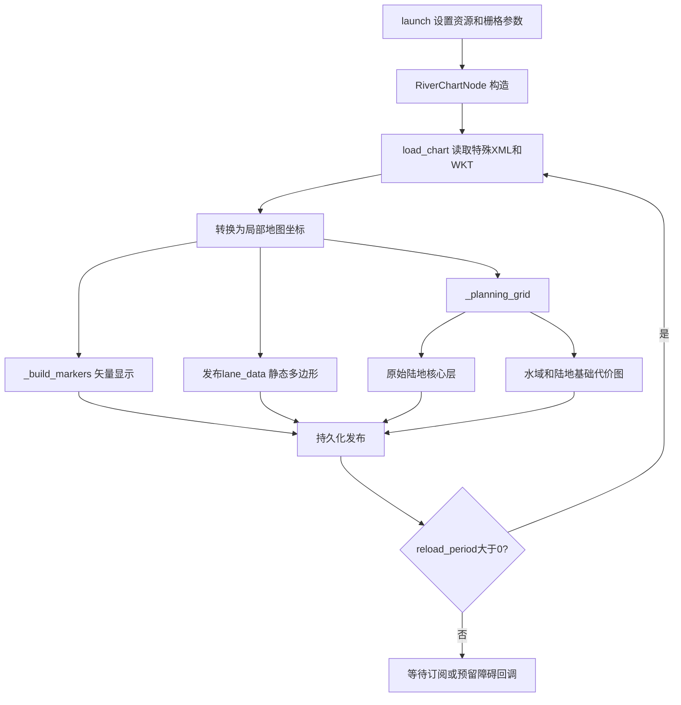
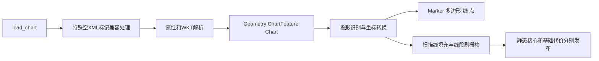

# 河图发布包详细说明

本包保留用户提供的河图解析/发布实现，本轮仅补功能注释与说明，不改变几何或栅格生成行为。入口 launch/river_chart.launch.py，节点 river_chart/node.py，解析器 river_chart/parser.py。

## 1. 输出是不同层，不能混为一张航道图

| 话题 | 类型与用途 | 下游 |
|---|---|---|
| /chart_markers | MarkerArray，矢量海图，绿色边线用于观察 | RViz |
| /chart_lane_data | String内JSON，TSSLPT多边形、ORIENT等静态几何 | channel_navigation_manager 动态选择主航道 |
| /chart_costmap | OccupancyGrid，规划基础静态水域/陆地栅格 | local_costmap_generator |
| /chart_static_obstacles | OccupancyGrid，原始陆地核心层 | Hybrid 保留硬安全约束 |
| /chart_metadata | String内JSON，范围及资源元数据 | 调试/其他消费者 |
| /chart_channel_direction | MarkerArray，可选方向显示 | RViz，不等于主航道判断 |
| /chart_occupancy | OccupancyGrid，可选显示用栅格 | 不是当前规划地图来源 |

输入 future_obstacles / PoseArray 是预留障碍入口：当前位置直接写入基础规划图，未实现独立障碍层和TF转换。航道内障碍只写入这里可能被下游岸线清零逻辑忽略，不应宣称该入口已经满足航道内障碍完整安全需求。

## 2. 一次发布和启动过程

构造读取参数、创建持久化发布器与预留障碍订阅，随后立即解析文件和发布。默认 reload_period=0，静态海图只发布一次；晚启动的持久化订阅仍可收到。正数才建立重载定时器，重载不是全局A*定期搜索。

海图发布一次不会妨碍反向主航道变化：静态几何不变，channel_navigation_manager 根据航行意图重新分类并发布语义图。

## 3. 解析和栅格函数关系

解析器支持点、线、多边形及多部件数据；源码处理导出格式特殊标记，不应直接用普通XML格式校验器否定资源。坐标识别包含投影坐标、经纬度和导出Y反向处理。当前scale会缩放几何坐标，不只是调整显示线宽；改变它须同步本船位置、目标点及尺寸，防止物理米制不一致。

规划基础层可以沿海图航路线刷出低代价走廊，但其角色不是右/左主航道判定。channel_corridor_width在当前实现中作为刷图半径使用，完整走廊宽度约两倍该值。多边形孔洞、复杂凹多边形三角显示等不等于完整GIS拓扑库保证。

## 4. 参数与使用

本包目前没有加载的YAML，参数主要在节点声明与launch覆盖中。PARAMETERS.md说明默认值和有效覆盖，不新增一个实际没被加载的配置文件。

先 source ROS 和工作空间，再运行 ros2 launch river_chart river_chart.launch.py 可独立查看海图；需要船航行请使用 channel_navigation_manager 的河道一键启动，因为单独海图启动不会运行膨胀、全局规划、Hybrid、DWA和本船。map→odom当前一键配置为单位静态TF。

## 源码函数逐项索引

以下按文件列出已注释函数。`[功能与联系]`代码注释可直接定位职责；同名重载/不同类函数分列。函数内局部计算与分支说明保留原有注释。流程图展示主要调用链，表格覆盖辅助函数、入口和测试。

### river_chart/node.py

生产或启动辅助源码。

| 函数 | 主要职责、调用联系与作用 |
|---|---|
| `_default_input_path` | 定位安装包海图资源，供启动参数默认路径使用，避免依赖源码绝对路径。 |
| `_color_for_group` | 将海图类别映射为显示颜色；只影响Marker，不改变航道语义或安全栅格。 |
| `_point` | 构造Marker几何点；绘图辅助函数。 |
| `_all_points` | 遍历海图所有几何坐标，供规划/显示网格边界估计。 |
| `_centroid` | 求要素显示中心，用于标签/点显示；不是导航目标或航道中心线。 |
| `_fan_triangles` | 用扇形三角片生成填充显示；不是复杂凹多边形的严格剖分或碰撞模型。 |
| `__init__` | 读取本节点参数并创建ROS输入输出/调度；后续回调与主循环关系见包内功能说明。 |
| `_float_parameter` | 将非有限经纬度参数转为None，允许parser自动选择原点。 |
| `_load` | 读取输入文件并传入原点/scale参数给load_chart；由_publish_chart调用。 |
| `_publish_chart` | 加载海图、缓存Chart并发布Marker/静态航道JSON/规划层/元数据；reload_period=0时启动执行一次。 |
| `_lane_data_json` | 提取TSSLPT多边形和ORIENT形成轻量静态JSON，供channel_navigation_manager分类；不从绿色Marker颜色反推属性。 |
| `_future_obstacles_callback` | 缓存PoseArray障碍位置并重建规划层；当前写入chart_costmap，不是直接发布独立/channel/obstacle_costmap。 |
| `_planning_bounds` | 由全部要素坐标求规划地图外接范围，供_new_planning_grid确定网格。 |
| `_new_planning_grid` | 创建规划网格并按max_cells必要时降分辨率；data与坐标元信息供所有规划层共享。 |
| `_raster_segment` | 沿线段密采样并刷写圆形邻域，生成物理障碍边缘或航道附近底图低代价区域。 |
| `_planning_grid` | 分别绘制原始陆地核心和chart_costmap，叠加预留障碍点；此栅格与主/对向角色分类是两回事。 |
| `_fill_polygon` | 扫描线填充多边形占用；构建物理静态层，不执行右行策略判定。 |
| `_build_direction_markers` | 按几何线段生成方向显示箭头；不等同于TSSLPT ORIENT主航道判定。 |
| `_publish_planning_layers` | 发布静态核心图和chart_costmap，后者由local_costmap_generator膨胀；可选方向Marker用于显示。 |
| `_base_marker` | 填入Marker头、id、namespace、类型及基础姿态，供各海图显示要素复用。 |
| `_set_color` | 按类别和透明度设置Marker颜色，供_build_markers共用。 |
| `_build_markers` | 将线/面/点/标签转换为矢量海图MarkerArray供RViz；不是可通行栅格生成函数。 |
| `_build_occupancy_grid` | 创建可选显示占用图chart_occupancy；默认关闭，与chart_costmap规划输入分开。 |
| `main` | 初始化ROS上下文、创建本文件节点并进入回调调度；退出时释放节点与通信资源，是launch启动可执行程序后的入口。 |
| `mark` | 在可选显示占用图中刷写一个格子；与用于实际规划的_planning_grid区分。 |

### river_chart/parser.py

生产或启动辅助源码。

| 函数 | 主要职责、调用联系与作用 |
|---|---|
| `groups` | 返回海图要素类别去重列表，供元数据和显示筛选。 |
| `feature_count` | 返回已解析有效要素数，供元数据和日志。 |
| `metadata_json` | 序列化地图来源、原点、scale和要素统计，用于锁存诊断话题。 |
| `_tokenize_wkt` | 将WKT字符串切分为几何类型、括号与数字token，供递归坐标解析。 |
| `_parse_group` | 递归读取括号坐标结构及数字序列，供parse_wkt处理多段/多环。 |
| `_as_point` | 验证并转换二维坐标对，供WKT标准化。 |
| `_as_path` | 将坐标序列标准化为不可变点列表，供Geometry几何parts构建。 |
| `parse_wkt` | 解析POINT/LINESTRING/POLYGON及多几何WKT，将要素标准化；格式异常抛ChartParseError。 |
| `_inverse_mercator_latitude` | 将Mercator northing还原为纬度，处理源导出坐标系。 |
| `_global_bounds` | 从地图元数据求全局经纬度范围，用于默认参考原点。 |
| `_iter_wkt_elements` | 遍历XML要素几何字段，向load_chart提供待解析WKT。 |
| `_transform_geometry` | 对Geometry的每个点应用投影函数，输出局部坐标。 |
| `load_chart` | 修复特定非法空标签、解析XML/WKT并按源投影转换局部坐标；scale实际除坐标值，影响整链路几何尺寸。 |
| `transform` | 将源坐标转换为局部平面坐标并除以scale；load_chart按源投影选择此闭包，不能只改变Marker显示而忽略规划坐标。 |
| `transform` | 将源坐标转换为局部平面坐标并除以scale；load_chart按源投影选择此闭包，不能只改变Marker显示而忽略规划坐标。 |

### launch/river_chart.launch.py

生产或启动辅助源码。

| 函数 | 主要职责、调用联系与作用 |
|---|---|
| `generate_launch_description` | 组装节点、参数与条件启动动作；launch只负责接线，不直接执行规划或控制。 |

### test/test_launch.py

测试/诊断程序，不属于生产控制循环。

| 函数 | 主要职责、调用联系与作用 |
|---|---|
| `test_launch_description_loads` | 执行此场景的输入构造和断言核验；用于回归验证，不参与正常航行控制。具体通过条件以函数内断言为准。 |

### test/test_parser.py

测试/诊断程序，不属于生产控制循环。

| 函数 | 主要职责、调用联系与作用 |
|---|---|
| `test_parse_polygon_and_hole` | 执行此场景的输入构造和断言核验；用于回归验证，不参与正常航行控制。具体通过条件以函数内断言为准。 |
| `test_parse_multi_geometries` | 执行此场景的输入构造和断言核验；用于回归验证，不参与正常航行控制。具体通过条件以函数内断言为准。 |
| `test_parse_bad_wkt_is_actionable` | 执行此场景的输入构造和断言核验；用于回归验证，不参与正常航行控制。具体通过条件以函数内断言为准。 |
| `test_load_chart_sanitizes_empty_tags_and_converts_projected_coordinates` | 执行此场景的输入构造和断言核验；用于回归验证，不参与正常航行控制。具体通过条件以函数内断言为准。 |
| `test_load_chart_uses_map_bounds_as_default_origin` | 执行此场景的输入构造和断言核验；用于回归验证，不参与正常航行控制。具体通过条件以函数内断言为准。 |
| `test_load_chart_retains_s57_feature_type` | 执行此场景的输入构造和断言核验；用于回归验证，不参与正常航行控制。具体通过条件以函数内断言为准。 |
| `test_load_chart_converts_inverted_web_mercator_to_local_meters` | 执行此场景的输入构造和断言核验；用于回归验证，不参与正常航行控制。具体通过条件以函数内断言为准。 |
| `test_rejects_invalid_scale` | 执行此场景的输入构造和断言核验；用于回归验证，不参与正常航行控制。具体通过条件以函数内断言为准。 |

### test/test_node.py

测试/诊断程序，不属于生产控制循环。

| 函数 | 主要职责、调用联系与作用 |
|---|---|
| `chart_node` | 执行此场景的输入构造和断言核验；用于回归验证，不参与正常航行控制。具体通过条件以函数内断言为准。 |
| `test_point_feature_wrapped_as_polygon_publishes_rviz_points` | 执行此场景的输入构造和断言核验；用于回归验证，不参与正常航行控制。具体通过条件以函数内断言为准。 |
| `test_line_feature_drops_exporter_added_closing_vertex` | 执行此场景的输入构造和断言核验；用于回归验证，不参与正常航行控制。具体通过条件以函数内断言为准。 |
| `test_lane_data_preserves_tsslpt_orientation` | 执行此场景的输入构造和断言核验；用于回归验证，不参与正常航行控制。具体通过条件以函数内断言为准。 |

